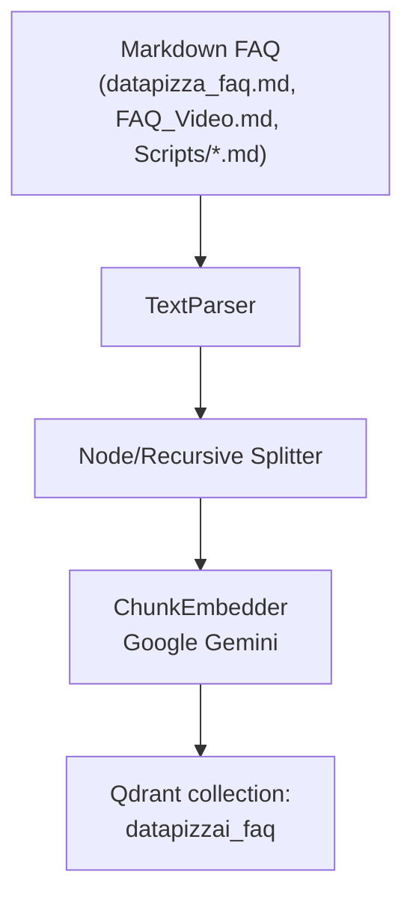
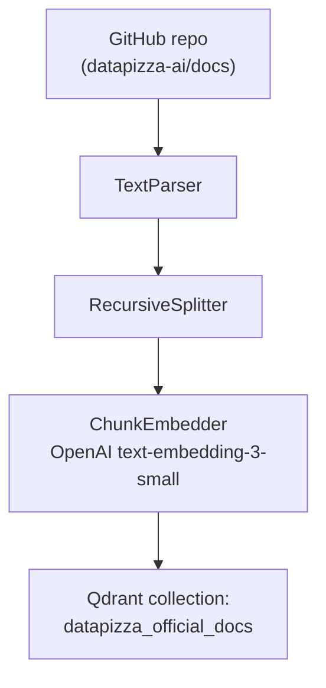
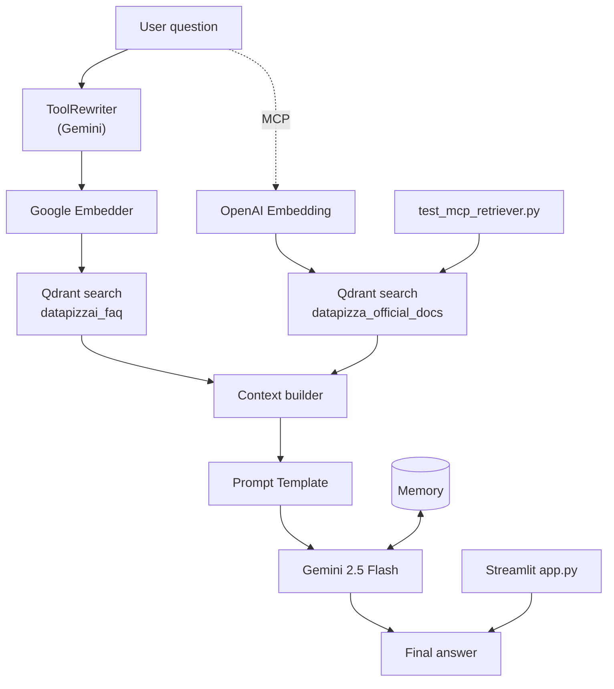

# Datapizza-AI FAQ RAG Chatbot

English-language documentation for developers who want to understand, run, and extend the project.

## Project overview

This repository contains a complete Retrieval-Augmented Generation (RAG) stack that answers questions about Datapizza-AI by combining local FAQ markdown files and the official documentation indexed via MCP. The chatbot uses Google Gemini for embeddings and generation, Streamlit for the UI, and Qdrant as the vector database. When no relevant information is found, it falls back to the exact sentence “Non sono ancora state fatte domande a riguardo.”

## Key features

- Streamlit front end with multilingual UI and debugging tools
- Semantic retrieval powered by Google embeddings (`gemini-embedding-001` by default)
- Query rewriting to improve recall on ambiguous prompts
- Qdrant vector store with dynamic dimension detection
- Google Gemini 2.5 Flash for response generation with conversation memory
- Dual interface: modern web experience and terminal chatbot
- Modular pipelines for ingestion, retrieval, and generator orchestration
- Optional integration with the official docs through the MCP server

## Architecture

### Ingestion pipeline
```
Markdown FAQs → TextParser → NodeSplitter → ChunkEmbedder → Qdrant vector store
```

### Retrieval pipeline (DagPipeline)
```
User query → ToolRewriter → Embedder → Qdrant retrieval → Prompt template → Gemini 2.5 Flash + Memory
```

### RAG overview (FAQs + official docs)
The system is split into FAQ ingestion, official documentation ingestion via MCP, and a retrieval/generation stack that merges both sources when available.

#### FAQ ingestion


#### Documentation ingestion (MCP)


#### Retrieval and reasoning


## Quick start

### Option A: Web interface (recommended)

```bash
# Activate the virtual environment
source rag/bin/activate

# Configure .env with your Google and OpenAI keys

# Start Qdrant in another terminal
docker run -p 6333:6333 -p 6334:6334 qdrant/qdrant

# Launch the Streamlit UI
./run_web.sh
# or
streamlit run app.py
```

### Option B: Terminal chatbot

```bash
source rag/bin/activate

# Set GOOGLE_API_KEY in .env

docker run -p 6333:6333 -p 6334:6334 qdrant/qdrant

python chatbot_faq.py
# or
./run_chatbot.sh
```

### First-time setup

```bash
source rag/bin/activate
pip install -r requirements.txt

cp .env.example .env
# add your API keys

docker run -p 6333:6333 -p 6334:6334 qdrant/qdrant

python test_setup.py          # validate environment
python ingest_faq.py          # index FAQ files

./run_web.sh                  # Streamlit UI
# or
python chatbot_faq.py         # terminal mode
```

## Example usage

```
You: What makes Datapizza-AI different from LangChain?

Bot: The main difference is the abstraction level of each module. LangChain
keeps you on rails, while Datapizza-AI exposes low-level knobs so you can
tune each step of your RAG workflow...

You: Does it support open-source models?

Bot: Yes. The framework works with Llama models as documented in the official
guides, where you can run a client or server locally...

You: What is photosynthesis?

Bot: Non sono ancora state fatte domande a riguardo.
```

## Project structure

```
datapizzaAI-RAG/
├── app.py                    # Streamlit front end
├── chatbot_faq.py            # FAQ chatbot (Gemini + DagPipeline)
├── chatbot_enhanced.py       # FAQ + MCP docs chatbot
├── ingest_faq.py             # FAQ ingestion script
├── official_docs_retriever.py# MCP retriever helper
├── datapizza_faq.md          # Main FAQ file
├── FAQ_Video.md              # FAQs extracted from video tutorials
├── Scripts/*.md              # English transcripts, auto-tagged
├── qdrant_config.py          # Qdrant helpers and collection setup
├── run_web.sh / run_chatbot.sh
├── tests/*.py                # Setup, chatbot, and MCP tests
├── README.md, START_HERE.md, USAGE_GUIDE.md, etc.
└── requirements.txt
```

## Technology stack

- [Datapizza-AI](https://docs.datapizza.ai/) for pipelines, modules, and clients
- [Streamlit](https://streamlit.io/) for the user interface
- [Google Gemini](https://ai.google.dev/) for embeddings and LLM responses
- [Qdrant](https://qdrant.tech/) for similarity search
- Python 3.13 or newer

## Main components

### ingest_faq.py
Builds an `IngestionPipeline` that reads markdown FAQ files, splits content into semantically meaningful chunks, generates embeddings with Google Gemini, automatically includes English scripts under `Scripts/` with metadata (`language="en"`, `type="scripts"`), and stores everything in the `datapizzai_faq` Qdrant collection. The script detects embedding dimensionality at runtime so the vector store is always created with the correct size.

### chatbot_faq.py
Implements a DagPipeline chatbot with query rewriting, vector retrieval, Gemini generation, and conversation memory. If no relevant information is returned, the answer falls back to “Non sono ancora state fatte domande a riguardo.” The class exposes parameters for `k`, `score_threshold`, maximum chunk size, and debug mode.

### app.py
Streamlit front end with multilingual support (Italian, English, German). It offers configuration toggles, statistics, debugging panels for retrieved chunks, and an optional hook for the official documentation if MCP indexing is available.

### chatbot_enhanced.py and official_docs_retriever.py
Extended chatbot that merges FAQ chunks and documentation chunks retrieved through the MCP server and the `datapizza_official_docs` collection. It manages language-specific fallbacks, asynchronous calls, and fine-grained debug traces.

## Advanced configuration

You can tweak the chatbot behavior in `chatbot_faq.py`:

```python
k = 10               # number of chunks retrieved
score_threshold = 0.5
max_char = 2000      # chunk size for NodeSplitter
```

To switch models, set environment variables (`FAQ_EMBEDDING_MODEL`, `FAQ_EMBEDDING_DIM`) or instantiate alternative clients such as `OpenAIClient` or `AnthropicClient`.

## Troubleshooting

- **“GOOGLE_API_KEY not found”**  
  Create `.env`, set `GOOGLE_API_KEY`, and reload the shell.

- **“Connection refused” when calling Qdrant**  
  Ensure the Docker container is running: `docker ps | grep qdrant`.

- **“Collection not found”**  
  Run `python ingest_faq.py`. If you changed embedding dimensions, delete the existing collection first.

- **Bot always responds with the fallback**  
  Verify ingestion logs, lower `score_threshold`, and confirm embeddings were created with the same model used at inference time.

## Resources

- [Datapizza-AI documentation](https://docs.datapizza.ai/)
- [RAG guide](https://docs.datapizza.ai/0.0.2/Guides/RAG/rag/)
- [Google AI Studio](https://ai.google.dev/)
- [Qdrant docs](https://qdrant.tech/documentation/)
- [Gemini API docs](https://ai.google.dev/docs)

## Contributing

This project is meant as a working example. Feel free to add FAQs, experiment with new models, improve prompts, or extend the UI. Pull requests and issue reports are welcome.

## License

Sample project demonstrating the Datapizza-AI framework. Refer to the repository license for details.

## Author

Built as an example integration for the [Datapizza-AI](https://github.com/datapizza-labs/datapizza-ai) framework.
