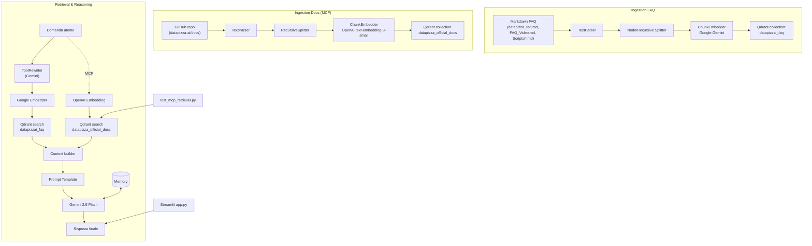

# Chatbot RAG FAQ Datapizza-AI

Un chatbot RAG intelligente che risponde alle domande frequenti su Datapizza-AI, costruito utilizzando il framework datapizza-ai.

## 🎯 Descrizione

Questo progetto implementa un sistema RAG (Retrieval-Augmented Generation) completo che:
- **Analizza** le FAQ su Datapizza-AI contenute in file markdown
- **Risponde** alle domande degli utenti basandosi esclusivamente sulle informazioni nelle FAQ
- **Restituisce** un messaggio specifico quando non trova informazioni rilevanti: "Non sono ancora state fatte domande a riguardo."

## ✨ Caratteristiche

- 🌐 **Interfaccia web moderna** con Streamlit - UI pulita e intuitiva
- 🔍 **Retrieval semantico** con embeddings Google (default: gemini-embedding-001)
- 🧠 **Query rewriting** per migliorare il retrieval
- 💾 **Vector store** Qdrant per memorizzazione efficiente
- 🤖 **Generazione risposte** con Google Gemini 2.5 Flash
- 💬 **Memory attiva** - mantiene il contesto della conversazione
- 🔄 **Doppia interfaccia** - Web e terminale
- 📝 **Pipeline modulare** facilmente estensibile
- 🎨 **Design minimal** e user-friendly

## 🏗️ Architettura

### Pipeline di Ingestion
```
File Markdown → TextParser → NodeSplitter → ChunkEmbedder → Qdrant VectorStore
```

### Pipeline di Retrieval (DagPipeline)
```
Query Utente → ToolRewriter → Embedder → VectorStore Retrieval → Prompt Template → Generator (Gemini 2.5 Flash) + Memory
```

### Vista d'insieme del RAG (FAQ + docs ufficiali)


## 🚀 Quick Start

### Opzione A: Interfaccia Web (Consigliata) 🌐

```bash
# 1. Attiva l'environment
source rag/bin/activate

# 2. Configura .env con la tua API key OpenAI

# 3. Avvia Qdrant (terminale separato)
docker run -p 6333:6333 -p 6334:6334 qdrant/qdrant

# 4. Avvia il frontend web
./run_web.sh
# oppure: streamlit run app.py
```

L'interfaccia web si aprirà automaticamente nel browser! 🎉

### Opzione B: Terminale 💻

```bash
# 1. Attiva l'environment
source rag/bin/activate

# 2. Configura .env con la tua API key Google (Gemini)

# 3. Avvia Qdrant (terminale separato)
docker run -p 6333:6333 -p 6334:6334 qdrant/qdrant

# 4. Avvia il chatbot da terminale
python chatbot_faq.py
# oppure: ./run_chatbot.sh
```

### Setup Completo (Prima Volta)

```bash
# 1. Attiva l'environment virtuale
source rag/bin/activate

# 2. Installa le dipendenze
pip install -r requirements.txt

# 3. Configura le variabili d'ambiente
cp .env.example .env
# Modifica .env e inserisci la tua API key

# 4. Avvia Qdrant
docker run -p 6333:6333 -p 6334:6334 qdrant/qdrant

# 5. Verifica il setup
python test_setup.py

# 6. Esegui l'ingestion delle FAQ
python ingest_faq.py

# 7. Avvia il chatbot (web o terminale)
./run_web.sh          # Interfaccia web
# oppure
python chatbot_faq.py # Terminale
```

## 💡 Esempi di Utilizzo

```
👤 Tu: Cosa differenzia Datapizza-AI da Langchain?

🤖 Bot: La differenza principale con altri framework è il diverso livello
di astrazione dei moduli. Langchain usa astrazioni troppo elevate che non
permettono di uscire facilmente dai binari imposti...

👤 Tu: Supporta modelli open-source?

🤖 Bot: Sì, il framework supporta anche modelli Llama. Nella documentazione
su docs.datapizza.ai puoi trovare le istruzioni per eseguire un client
Llama o un server Llama in locale...

👤 Tu: Che cos'è la fotosintesi clorofilliana?

🤖 Bot: Non sono ancora state fatte domande a riguardo.
```

## 📁 Struttura del Progetto

```
datapizzaAI-RAG/
├── app.py                    # 🌐 Frontend web (Streamlit) - NUOVO!
├── chatbot_faq.py            # 🤖 Chatbot RAG core
├── ingest_faq.py             # 📥 Script per ingestion FAQ
├── datapizza_faq.md          # 📄 FAQ generali su Datapizza-AI
├── FAQ_Video.md              # 🎥 FAQ estratte da video tutorial
├── test_setup.py             # ✅ Script per verificare il setup
├── test_chatbot.py           # 🧪 Test automatici
├── check_qdrant.py           # 🔍 Verifica contenuto Qdrant
├── run_web.sh                # 🌐 Avvio rapido frontend web - NUOVO!
├── run_chatbot.sh            # 💻 Avvio rapido terminale
├── requirements.txt          # 📦 Dipendenze Python
├── .env                      # 🔐 Configurazione (da creare)
├── .env.example              # 📋 Template configurazione
├── .gitignore                # 🚫 Esclusioni Git
├── README.md                 # 📖 Questo file
├── START_HERE.md             # 🚀 Guida avvio rapido
├── USAGE_GUIDE.md            # 📚 Guida utente dettagliata
├── WEB_FEATURES.md           # 🌐 Caratteristiche frontend
├── INTERFACE_PREVIEW.md      # 🎨 Anteprima interfaccia
└── setup_instructions.md     # 🛠️ Istruzioni setup complete
```

## 🛠️ Tecnologie Utilizzate

- **[Datapizza-AI](https://docs.datapizza.ai/)** - Framework GenAI modulare
- **[Streamlit](https://streamlit.io/)** - Framework per interfaccia web interattiva
- **[Google Gemini](https://ai.google.dev/)** - Embeddings (gemini-embedding-001 di default) e LLM (Gemini 2.5 Flash)
- **[Qdrant](https://qdrant.tech/)** - Vector database per similarity search
- **Python 3.13+** - Linguaggio di programmazione

## 📖 Componenti Principali

### ingest_faq.py
Script che implementa la **IngestionPipeline** per:
- Leggere i file markdown delle FAQ
- Dividere il testo in chunks semantici
- Generare embeddings con Google (gemini-embedding-001, 3072 dimensioni di default – personalizzabili impostando `FAQ_EMBEDDING_MODEL` o `FAQ_EMBEDDING_DIM`)
- Includere automaticamente i copioni in inglese della cartella `Scripts/`, marcandoli con metadati `language="en"` e `type="scripts"`
- Salvare nel vector store Qdrant

### chatbot_faq.py
Implementa il chatbot usando **DagPipeline** con:
- Query rewriting per migliorare il retrieval
- Embedding della query
- Retrieval semantico dei chunks rilevanti
- Generazione risposta contestualizzata con Gemini 2.5 Flash
- Memory per mantenere il contesto della conversazione
- Fallback message quando non trova informazioni

## 🔧 Configurazione Avanzata

### Parametri del Chatbot

Nel file `chatbot_faq.py` puoi modificare:

```python
# Numero di chunks da recuperare
k = 10

# Soglia minima di similarity score
score_threshold = 0.5

# Dimensione massima dei chunks
max_char = 2000
```

### Modelli Alternativi

Puoi cambiare i modelli Google con altre varianti:

```python
# Per embeddings - altre opzioni Google
embedder = GoogleEmbedder(
    model_name="gemini-embedding-001"  # Default attuale (imposta FAQ_EMBEDDING_MODEL per cambiarlo)
)

# Per generazione - altri modelli Gemini
client = GoogleClient(
    model="gemini-2.5-flash"  # Gemini 2.5 Flash (attuale)
)

# Oppure altri provider (OpenAI, Anthropic, Mistral, etc.)
from datapizza.clients.openai import OpenAIClient
client = OpenAIClient(model="gpt-4o")
```

## 🐛 Troubleshooting

### "GOOGLE_API_KEY non trovata"
→ Crea il file `.env` e inserisci la tua API key Google:
```bash
GOOGLE_API_KEY=your-google-api-key-here
```
→ Ottieni una chiave API da: https://ai.google.dev/

### "Connection refused" (Qdrant)
→ Verifica che Qdrant sia in esecuzione: `docker ps | grep qdrant`

### "Collection not found"
→ Esegui prima l'ingestion: `python ingest_faq.py`
→ NOTA: Se hai già una collection con dimensioni 1536 (OpenAI), devi ricrearla!

### Risposte sempre "Non sono ancora state fatte domande..."
→ Verifica che l'ingestion sia andata a buon fine
→ Prova ad abbassare la `score_threshold`
→ Verifica che gli embeddings siano stati creati correttamente

## 📚 Risorse

- [Documentazione Datapizza-AI](https://docs.datapizza.ai/)
- [Guida RAG](https://docs.datapizza.ai/0.0.2/Guides/RAG/rag/)
- [Google AI Studio](https://ai.google.dev/)
- [Qdrant Documentation](https://qdrant.tech/documentation/)
- [Gemini API Documentation](https://ai.google.dev/docs)

## 🤝 Contribuire

Questo è un progetto di esempio. Sentiti libero di:
- Aggiungere nuove FAQ
- Migliorare i prompt
- Sperimentare con diversi modelli
- Estendere le funzionalità

## 📝 Licenza

Progetto di esempio per dimostrare le capacità di Datapizza-AI.

## 👥 Autore

Progetto creato come esempio di utilizzo del framework [Datapizza-AI](https://github.com/datapizza-labs/datapizza-ai)
